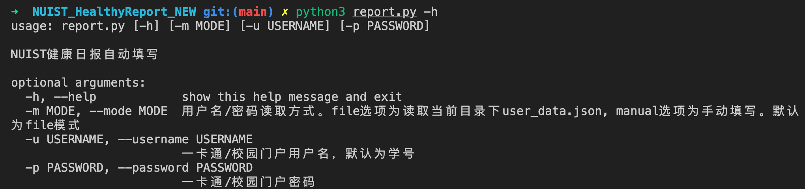
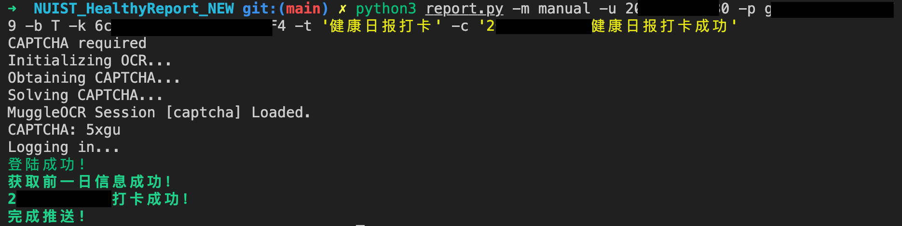

# NUIST_HealthyReport_NEW

[](https://github.com/InfinityWei/NUIST_HealthyReport_NEW/actions/workflows/main.yml)

可能是首个支持新版健康管理的 Python 自动填写工具，顺便支持了一下自动识别统一认证的验证码

**由于政策调整，本项目已完成其历史使命，不再具有任何实际用途，感谢大家的Commits和Stars**

新系统与东南大学的系统有部分相似，故本项目基于来自 SEU 的同学的 GitHub 项目：https://github.com/cogkitten/seu-daily-report 大量修改而来。

统一认证验证码在旧系统的自动填报脚本中就已成功识别，利用 muggle_ocr 解决了统一认证添加强制验证码的逻辑，可正常登陆填报

验证码识别基于南京大学校园网登陆脚本项目：https://github.com/cubiccm/NJU-Network-Authenticate

### 特别提醒

这里仅技术论证了健康日报的单次自动提交功能，一定程度上可以节约**身体健康的同学**填报健康日报的时间，但**请不要隐瞒自己的健康状况！**

**重要更新：新版本已彻底解决通过原有方式填报虽然有记录，但仍然被认为是当日未填报且收到提醒的问题，新版本可在同一天多次使用，不会造成多条记录，且不会被系统提醒，建议所有用户更新！**

> **如果有特殊情况，请立即停用并修改当天记录为实际情况！**
> **因隐瞒自身健康状况导致的一切后果，本项目一概不负责！**

> **附判断当天填报是否被系统认可为有效填报（当日已填报）的方法：** 检查手机端健康管理首页是否有记录且右下角无蓝色填写按钮，如有记录且右下角无蓝色填写按钮，表明今日填报已被系统认可为有效填报（当日已填报），且不再会收到恼人的提醒。

### **云端部署警告**

> 由于腾讯云涨价，本项目已不建议使用腾讯云部署。

如果你需要将项目部署至 Github Actions 云端运行，请务必将仓库属性设置为**私有**，或在Secrets中添加学号密码等参数，并在workflow配置文件中手动引用，否则你的校园网账号可能泄露。

由于Python脚本的运行会有超时设定，高峰期会经常运行失败，如您确实需要使用云端部署，建议将自动化时间设置在北京时间9:30（GitHub使用UTC时间，应为1:30）以后，在9:30后签到的成功率会更高，当然，这是一个经验主义的结论。

### 可选参数

```
NUIST健康日报自动填写

optional arguments:
  -h, --help            show this help message and exit
  -m MODE, --mode MODE  用户名/密码读取方式。file选项为读取当前目录下user_data.json, manual选项为手动填写。默认为file模式
  -u USERNAME, --username USERNAME
                        一卡通/校园门户用户名，默认为学号
  -p PASSWORD, --password PASSWORD
                        一卡通/校园门户密码
  -bk BARK_TOKEN, --bark_token BARK_TOKEN
                        Bark推送的个人token，留空则不进行推送。
  -bt BARK_TITLE, --bark_title BARK_TITLE
                        Bark推送标题
  -bc BARK_CONTENT, --bark_content BARK_CONTENT
                        Bark推送正文
  -sk SCT_TOKEN, --sct_token SCT_TOKEN
                        Server推送的个人token，留空则不进行推送。
  -st SCT_TITLE, --sct_title SCT_TITLE
                        Server推送标题
  -sc SCT_CONTENT, --sct_content SCT_CONTENT
                        Server推送正文
```

使用样例

```
python3 report.py
使用配置文件读取登陆信息，且不使用推送功能

python3 report.py -m manual -u 2020xxxxxxxx -p xxxxxxxxx
不读取配置文件，使用手动输入用户名密码的方式登陆

python3 report.py -m manual -u 2020xxxxxxxx -p xxxxxxxxx -bk Sdxwo9xxxxxxx -bc xxx用户已打卡成功
使用手动方式登陆，并使用bark推送服务

python3 report.py -m manual -u 2020xxxxxxxx -p xxxxxxxxx -sk xxxxxxxx -st iamtitle
使用Server酱推送
```

---

### 使用方式

> 建议 Python 版本 >= 3.8

```
git clone https://github.com/InfinityWei/NUIST_HealthyReport_NEW.git
cd NUIST_HealthyReport_NEW
pip3 install -r requirements.txt
```

登陆方式有两种，但推荐使用第一种(配置文件登陆)，不会在 terminal 留下 history,且每次运行无需重复输入账号密码。

---

> 每次填报的内容只有内容和时间不同，如需修改其他内容，可以手动填写一次，在下一次运行时会自动调用上一次内容。

#### 方式一(推荐)

填写`user_data.json`文件

```json
{
  "username": "",
  "password": "",
  "sct": {
    "token": "",
    "title": "",
    "content": ""
  },
  "bark": {
    "token": "",
    "title": "",
    "content": ""
  }
}
```

直接运行

```
python3 report.py
```

---

#### 方式二(不推荐)

在命令中加入账号密码

```
python3 -m manual -u xxxx -p xxxx
```

---

### 自动化运行

> 另外注意，Linux 环境下可能需要 nodejs 环境
> yum install epel-release
> yum install nodejs

在服务器上设定定时任务，以每天定时执行

```
crontab -e
```

键入如下命令(每天早上 8 点运行)

```
# 后台运行，并将结果输出至out.file
0 8 * * * python3 report.py -m manual -u 2020xxxxxxxx -p xxxxxxxxx -bk Sdxwo9xxxxxxx -bc xxx用户已打卡成功 > out.file 2>&1 &
```

---

### 效果图





### 目前可用的类似项目推荐

**此项目可以一次性签满一个月，能够接受提前填报的朋友也可尝试：** https://github.com/lixiang810/NUISTHealthReport
